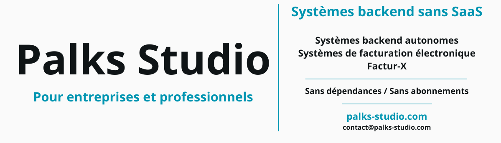

  

> 🇬🇧 English | [🇫🇷 Français](./README_FR.md)

  

# Palks Studio

> This repository is a presentation.  
> It does not contain downloadable source code or production files.

## Autonomous systems for freelancers and small teams

Automation, invoicing, internal tools and static architectures, deployed directly on the client’s infrastructure, without SaaS dependencies.

Replacement of existing tools with autonomous, controlled systems, without subscriptions.

---

## About

Independent developer, I design simple, reliable and maintainable technical systems.

My work focuses on tools actually used in production, with a strong emphasis on clarity, stability and autonomy.

---

## What I build

I develop autonomous technical systems used in real-world contexts: invoicing, automation and internal tools.

### Billing System

Complete invoicing system, deployed directly on the client’s infrastructure.

- quotes → signature → invoice → payment  
- PDF generation (client-side + server-side)  
- structured archiving without database  
- secure numbering and full traceability  
- automated email sending  
- bilingual interface (FR / EN)

Designed to replace SaaS invoicing tools while maintaining full control over data.

---

### Automation Finance

Batch invoicing system based on Factur-X (EN16931).

- automatic generation from CSV  
- structured invoice production  
- full archiving and traceability  
- secure delivery via token  
- reproducible batch processing

Used to automate recurring invoicing workflows.

[-0095b1?style=flat)](https://palks-studio.com/en/batch-invoicing-facturx)

#### Additional tools

**PDF Payment Stamping Engine**  
Tool for processing invoices in batch, integrated into Automation Finance workflows.

- ZIP import  
- automatic PDF detection  
- generation of stamped (paid) invoices  
- individual or batch export

---

### Other tools

- quote generator (100% browser-based)  
- static website foundations (HTML/CSS)  
- local chatbots (Flask)  
- documentation frameworks  
- development environment configurations

---

## What I deploy

I deploy selected systems directly on the client’s infrastructure.

This includes:  

- Billing System (complete invoicing)  
- Automation Finance (batch invoicing)  
- PDF payment stamping engine  
- custom developments based on client needs

Each deployment includes:  

- server installation (shared hosting or VPS)  
- full configuration (emails, paths, identity)  
- adaptation to existing data  
- testing and validation  
- user documentation

Objective: a stable, autonomous and maintainable system.

---

## Who it’s for

- freelancers  
- independent professionals  
- small teams  
- technical projects requiring simple and reliable tools

---

## Approach

- autonomous systems, no SaaS  
- minimal dependencies  
- readable architecture  
- predictable behavior  
- long-term maintainability  

The tools presented here prioritize clarity, stability and autonomy.  
The goal is not to add complexity, but to remove it.

Systems favor local execution whenever possible  
to reduce external dependencies and ensure portability.

- https://palks-studio.com
